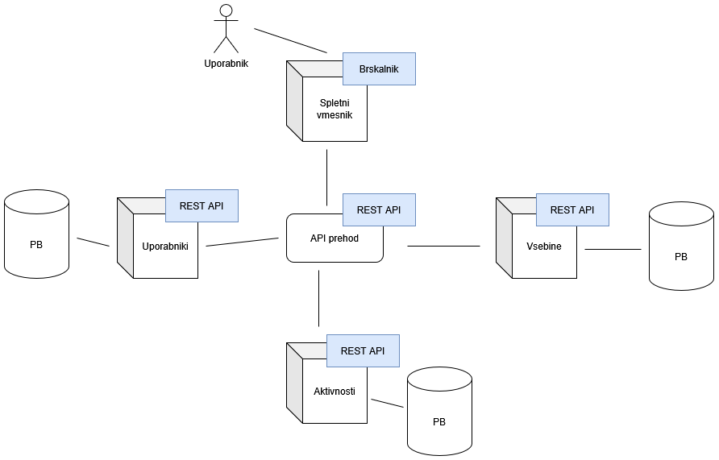

**MediaHub**

MediaHub je sistem za sledenje in deljenje izkušenj z raznimi zabavnimi vsebinami, kot so knjige, filmi, glasba, video igre, ipd.
Namenjen je primarno za samo-gostovanje znotraj družin ali ozkih krogov prijateljev. Uporabniki lahko vnesejo svojo zbirko vsebin različnih tipov ter jih ocenjujejo, komentirajo ali le delijo svoj napredek.

**Arhitektura**

MediaHub je mikrostoritven sistem, kjer storitve komunicirajo z izpostavljenimi REST API-ji.
Storitve:
- Uporabniki (registracija, prijava, avtentikacija, avtorizacija)
- Vsebine (podatki o vsebinah, npr. knjigah, serijah, ipd; podatki o zbirkah vsebin posameznih uporabnikov)
- Aktivnosti (npr. ocena, komentar, prebrana knjiga, priporočena igrica, itd.)

Diagram arhitekture:

